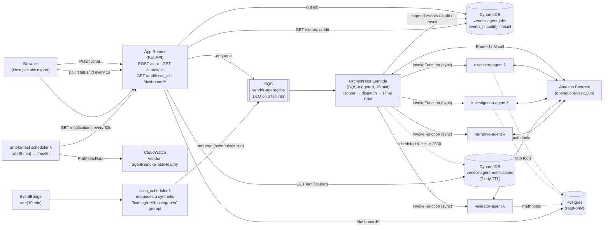

# Vendor Concentration — Agency 2026 (deployed)

Hackathon entry for **Challenge 5: Vendor Concentration**, packaged for
async deployment on AWS.

## Architecture

`POST /chat` enqueues a job and returns `{job_id}`. The frontend polls
`GET /status/:id` every ~1s and re-renders progress from the appended
`events[]` log written by the orchestrator and specialist Lambdas.



* **App Runner** — thin FastAPI service. `POST /chat` enqueues a job and
  returns `{job_id}`; `GET /status/:id` returns the appended event log
  plus the currently-active agent. Also serves the Next.js static export
  under `/` and the read-only `/dashboard/*` Postgres endpoints used by
  the homepage charts.
* **Orchestrator Lambda** — SQS-triggered, 15-min timeout. Runs the
  Router (one Bedrock call, no tools) inline, dispatches to specialist
  Lambdas (sequential pipeline for the `pipeline` route, single fan-out
  for the others), composes a deterministic Final Brief, writes
  everything into DynamoDB.
* **4 specialist Lambdas** — Discovery, Investigation, Validator,
  Narrative. Each builds the Strands agent it owns, runs it inside a
  `BufferedBus` (the Lambda analogue of the in-process EventBus), and
  returns `{parsed, raw_text, events, audit}` for the orchestrator to
  merge into the job record.
* **DynamoDB jobs table** — single hash key `job_id`, 24-hour TTL.
  Carries `events[]` (append-only log shaped exactly like the React
  layer's `ChatEvent`), `audit{}` (per-call_id math-tool blobs), and the
  final `result`.
* **SQS queue** — 910s visibility timeout (must exceed the orchestrator
  Lambda timeout); DLQ after 3 failed receives.
* **Smoke-test scheduler** — EventBridge schedule fires a Lambda every
  5 minutes. The Lambda pings `/health` and emits a CloudWatch metric
  (`vendor-agent/SmokeTest/Healthy`).
* **Auto-scan scheduler** — separate EventBridge schedule fires the
  `scan_scheduler` Lambda every 10 minutes. It enqueues a synthetic
  *"find high-HHI categories"* prompt onto the same SQS queue as
  user-facing chat, with `scheduled: true` on the message. The
  orchestrator runs the same pipeline as a user question; if the
  validated Final Brief contains any HHI metric over 2500 (the DOJ
  *highly concentrated* threshold), the orchestrator writes a row to
  the `vendor-agent-notifications` DynamoDB table. The frontend
  navbar's bell icon polls `GET /notifications` every 30 seconds; a
  click opens a "case dossier" modal with the headline, paraphrased
  summary, hits, cross-checks, and recommended action. See
  [Auto-scan & notifications](#auto-scan--notifications) below.

## Layout

```
agency-2026/
├── Dockerfile               App Runner image (pnpm build → static export, uv → uvicorn)
├── backend/
│   ├── server.py                       FastAPI (chat, status, audit, dashboards, static)
│   ├── pyproject.toml                  uv project for the App Runner image
│   ├── package_agents.py               builds linux/amd64 Lambda zips via Docker
│   ├── vendor_concentration_agent/     shared package — math, agents, tools, prompts, …
│   ├── orchestrator/handler.py         SQS entry; Router + dispatch + Final Brief
│   ├── discovery_agent/handler.py      thin wrapper over build_discovery_agent
│   ├── investigation_agent/handler.py
│   ├── validator_agent/handler.py
│   ├── narrative_agent/handler.py
│   ├── scheduler/handler.py            CloudWatch smoke-test (5-min)
│   └── scan_scheduler/handler.py       auto-scan trigger (10-min)
├── frontend/                Next.js 16 app — `output: 'export'`, pnpm
├── references/              source-document registry (referenced by the validator)
├── terraform/               main.tf, variables.tf, terraform.tfvars.example
└── docs/                    architecture + judges briefing
```

## Agents

The system answers Challenge 5 — *"In any given category of government
spending, how many vendors are actually competing? Where has incumbency
replaced competition?"* — with a five-agent pipeline. Every agent is a
Strands `Agent` running on Amazon Bedrock; each has a tightly-scoped
prompt and a curated subset of deterministic math tools. Agents reason
about which tools to call; **the tools compute the numbers**. No agent
ever invents a figure.

See `docs/architecture.md` and `docs/judges-context.md` for the long
form: scoring rubric, sub-theme mapping, references discipline, and the
full validator-gates contract.

### Pipeline shape

```
USER QUESTION
   │
   ▼
ROUTER ────────────────────────────────────► out_of_scope / narration / single specialist
   │   (one LLM call, no tools)
   │
   ▼     ── pipeline route ──
DISCOVERY  →  INVESTIGATION  →  VALIDATOR  →  NARRATIVE  →  FINAL BRIEF
                                              (paraphrase   (deterministic
                                               only)         JSON template)
```

- The **Router** runs inline inside the Orchestrator Lambda. The four
  **specialists** each live in their own Lambda and are invoked
  synchronously by the orchestrator (`lambda:InvokeFunction`).
- For the `pipeline` route the orchestrator runs Discovery →
  Investigation → Validator sequentially, threading each agent's
  `raw_text` into the next as conversational context. Once the
  Validator's verdict lands, the orchestrator invokes Narrative in
  **paraphrase mode** with the three structured outputs and the
  user's original question; Narrative returns
  `{"summary": "<2-3 sentences>"}` constrained to use only values
  that already appear in the upstream JSON. The orchestrator then
  composes a **Final Brief** by templating the structured outputs
  deterministically and slotting Narrative's paraphrase in as the
  brief's `summary` field. The orchestrator also appends the
  paraphrase as a plain `text` event after the Final Brief card so
  it reads as flowing prose at the bottom of the chat. If the
  Narrative call fails, the brief falls back to a mechanical summary
  so the pipeline still ships an answer.
- For the `discovery`, `investigation`, `validation`, or `narration`
  routes the orchestrator invokes only that one specialist (Narrative
  on the standalone `narration` route runs free-form, not in
  paraphrase mode).

### Per-agent responsibilities & tools

| Agent | Lives in | Job | Tools |
|---|---|---|---|
| **Router** | Orchestrator Lambda (inline) | Classify the question into one of 6 routes (`pipeline`, `discovery`, `investigation`, `validation`, `narration`, `out_of_scope`). | *None* — pure classification |
| **Discovery** | `discovery_agent` Lambda | Reframe the question into a measurable claim. Pick the dataset/category/dimension. Surface 3–5 candidate concentrated categories worth drilling into. Output: an investigation plan. | `list_top_concentrated_categories` |
| **Investigation** | `investigation_agent` Lambda | Compute the actual numbers. For each candidate from Discovery, run concentration metrics and surface the dominant vendor, its share, and how long it has held the category. Every figure carries its `tool_call_id` so the audit drawer can show the SQL + source rows. | `hhi_for_category`, `cr_n_for_category`, `gini_for_category`, `sole_source_share`, `how_long_has_vendor_held_category`, `vendor_full_footprint`, `how_many_distinct_vendors_in_category` |
| **Validator** | `validator_agent` Lambda | Cross-check Investigation's findings against a *second* source — sibling table (sole-source vs. competitive), cross-jurisdiction (AB ↔ FED ↔ open.canada.ca via `general.entity_match`), or finer-grained re-slice. Issue `MATCH` / `PARTIAL` / `DIVERGE` verdicts. Rule out by-design singletons (RCMP, Receiver General). | `cross_dataset_lookup_for_vendor`, `compare_two_computations`, `sole_source_share` *(deliberately NOT given the Investigation toolkit — letting Validator re-run HHI/CR_n with slightly different inputs would manufacture false DIVERGE verdicts)* |
| **Narrative** | `narrative_agent` Lambda | Two modes. **Paraphrase mode** (pipeline route): given the user's question + Discovery / Investigation / Validator structured outputs, emit a 2–3 sentence summary that answers the question using only values already present in those outputs — no new numbers, names, percentages, or claims. **Narration mode** (standalone `narration` route): re-explain a prior finding in plain English when the user explicitly asks. | *None* — writing only |

### The math layer (the trust boundary)

Every tool wraps a function in `backend/vendor_concentration_agent/math/`
that returns a `MathResult`:

```python
{
    "value":        <number>,
    "sql":          <string>,        # the exact query that produced it
    "source_rows":  [...],           # sample of underlying rows for audit
    "trace_steps":  [...],           # per-term arithmetic for the ⓘ popover
    "formula_id":   "hhi",           # key into math/explainers.py
    "references":   ["doj_hhi"],     # registry IDs (may be empty for pure counts)
}
```

| Module | Function | Computes | Reference |
|---|---|---|---|
| `math/concentration.py` | `hhi(category)` | Σ(market_shareᵢ)² over vendors | DOJ/FTC Horizontal Merger Guidelines §5.3 |
| `math/concentration.py` | `cr_n(category, n)` | Top-n combined share (CR1, CR4) | Standard industrial-org textbook |
| `math/concentration.py` | `gini(category)` | Inequality of contract value distribution | Statistics Canada Gini methodology |
| `math/procurement.py` | `sole_source_rate(scope)` | $ sole-source / $ total | Pure ratio |
| `math/procurement.py` | `incumbency_streak(vendor, category)` | Max consecutive fiscal years same vendor wins | Pure count |
| `math/procurement.py` | `vendor_footprint(vendor)` | Distinct (ministry, category) pairs | Pure count |
| `math/procurement.py` | `competition_count(category)` | Distinct vendors who ever won | Pure count |
| `math/crosscheck.py` | `cross_dataset_lookup(entity)` | Same entity totals across AB / FED / open.canada.ca via `general.entity_match` | — |
| `math/crosscheck.py` | `divergence_check(a, b)` | Δ% between two computations of "same" number | Pure arithmetic |

Postgres access is funnelled through one read-only helper
(`vendor_concentration_agent/data/postgres.py`); no agent or tool reaches
around it. **No invented metrics** — no `lockin_score`, no custom risk
indices. If a formula isn't in a textbook, government policy doc, or
standard methodology page, it doesn't ship.

### Cross-Lambda state — `BufferedBus`

Each specialist Lambda sets a `BufferedBus` on a contextvar before
running its agent. The Strands `@tool` wrappers in `tools/_wrap.py` push
math-tool cards (`tool` / `tool_result` / `tool_done` events) and audit
blobs (`{call_id → {sql, source_rows, …}}`) into the bus. After the
agent finishes, the Lambda dumps the bus and returns
`{parsed, raw_text, events, audit}`. The orchestrator merges those into
the DynamoDB job record so the polling frontend can render progress
agent-by-agent and tool-by-tool.

This is the Lambda analogue of the in-process `EventBus`. The React
layer's `ChatEvent` shape (`text` / `tool` / `tool_done` /
`tool_result`) is preserved exactly — the transport changed (SSE →
poll) but the event shape did not.

### Validator gates

Before the Final Brief is composed, the Validator runs three programmatic
checks. Failure on any check drops the offending claim or holds the
card back from display:

1. **Numeric sourcing** — every number has a `tool_call_id` resolving in
   this run's trace.
2. **Context sourcing** — every context claim has a `reference_id`
   resolving in `references/references.json` (URL responded 200, excerpt
   non-empty).
3. **Formula explainability** — every `formula_id` has a non-empty entry
   in `math/explainers.py`.

### Final Brief (deterministic structure, LLM-paraphrased summary)

`final_brief.py` composes the user-facing brief from the parsed
structured outputs of Discovery + Investigation + Validator. The
brief's `headline`, `metrics_table`, `verdict`, `confidence`,
`recommendation`, and `caveats` are templated by pure Python — no LLM
involved at that step, so those fields can never carry a number or
claim that wasn't already in a sourced agent output.

The `summary` field is the one exception: it comes from Narrative's
paraphrase pass, which is given the three structured outputs as JSON
and instructed to use only values that appear verbatim there. If the
paraphrase call fails for any reason, `final_brief.py` falls back to
a mechanical sentence assembled from metric counts and the verdict —
the brief always ships with *some* summary.

## Auto-scan & notifications

The same agent pipeline that answers user questions also runs
proactively on a 10-minute cron, scanning for high-concentration
categories without being asked.

### Flow

```
EventBridge (rate(10 min))
       │
       ▼
scan_scheduler λ
       │  enqueues SQS message:
       │    { "message": "Scan government spending and identify any
       │                  category with an HHI above 2500 …",
       │      "scheduled": true }
       ▼
orchestrator (same code path as user chat)
       │  Router → Discovery → Investigation → Validator → Narrative → Final Brief
       │
       ▼
_maybe_notify():
  if scheduled AND brief.metrics_table contains an HHI metric > 2500:
      write a row to vendor-agent-notifications DynamoDB
       │
       ▼
GET /notifications  ←  navbar bell polls every 30s
       │
       ▼
clicking a notification → "case dossier" modal with the headline,
                          paraphrased summary, hits, cross-checks,
                          and recommended action
```

The auto-scan reuses every part of the user pipeline — the Validator
still gates on cross-checks, the Narrative still paraphrases, the
Final Brief still composes deterministically. The only differences:

- The triggering message is synthesised by the `scan_scheduler`
  Lambda, not typed by a user.
- The orchestrator inspects `scheduled: true` on the SQS message and
  calls `_maybe_notify()` after the brief is composed.
- Notifications are filtered to high-HHI hits *only* — a clean run
  with no concentrations over the DOJ threshold writes nothing to
  the table.

### Notifications table

Schema in `vendor-agent-notifications` DynamoDB:

```json
{
  "notification_id": "<uuid>",
  "created_at":      "<ISO 8601 UTC>",
  "source_job_id":   "<orchestrator job ID; trace back to events/audit>",
  "question":        "<the synthetic prompt that triggered the scan>",
  "headline":        "<from final_brief>",
  "summary":         "<from final_brief — Narrative paraphrase>",
  "verdict":         "MATCH | PARTIAL | DIVERGE | INSUFFICIENT_DATA",
  "confidence":      "high | medium | low",
  "sub_theme":       "Efficiency | Integrity | Alignment",
  "hits": [
    { "metric": "HHI", "value": 4231, "interpretation": "highly concentrated", "call_id": "hhi-…" }
  ],
  "ttl": "<unix epoch + 7 days>"
}
```

7-day TTL — DynamoDB will reap older rows automatically.

### Frontend surfaces

The navbar bell (`components/layout/NotificationsBell.tsx`):

- Polls `GET /notifications` every 30 seconds.
- Renders an unread badge with a pulse animation when any
  notification's `created_at` is newer than the locally-stored
  `last-seen` timestamp (`localStorage.agency2026.notifications.last-seen`).
- Opens a portalled panel with a header that explains the pipeline
  cadence and the trigger threshold, plus a list of recent
  notifications (Syne headline, paraphrased summary, verdict pill,
  sub-theme label, hit count, mono timestamp).
- Empty state: *"Auto-scan is running. No high-concentration alerts
  yet."*

Clicking a row opens a **case dossier** modal
(`components/layout/NotificationDetailModal.tsx`):

- Verdict-coloured 5 px accent bar runs the full vertical edge of
  the modal.
- Hero header — sub-theme kicker, monospace dossier ID, Syne
  headline, ISO timestamp · job ID · source-table metadata strip,
  pills for verdict / confidence / hit count.
- Sections divided by hairline rules with tracked-out Syne kicker
  labels (`TRIGGER`, `SUMMARY`, `PRIMARY FINDING`, `CROSS-CHECKS`,
  `RECOMMENDED ACTION`, `SIMILAR CATEGORIES ELSEWHERE`).
- Primary finding card holds the headline HHI, a 4-column dossier
  `<dl>` (dominant vendor, ministry, share %, tenure), and an inline
  4-quarter SVG sparkline.
- Some fields are still dummy enrichment for now (vendor / ministry
  / sparkline / similar-categories list); they're keyed off the
  notification ID so each row's dossier is deterministic.

### Extending beyond the in-app bell

The current `_emit_notification()` writes to DynamoDB; production
deployments would typically fan out to one or more of:

| Channel | How |
|---|---|
| Slack | `requests.post(SLACK_WEBHOOK_URL, json={...})` next to the DDB write |
| Email / SMS | publish to an SNS topic with subscribers |
| Browser push | `Notification.requestPermission()` in the bell + tie `new Notification(...)` to the poll loop |
| Daily digest | a second scheduled Lambda that scans the table at 09:00 and composes a single email |

## Local development

```bash
# Backend
cp .env.example .env   # fill PG_DSN; AWS_* not needed for /dashboard
cd backend
uv sync
uv run uvicorn server:app --reload --port 8000

# Frontend (separate terminal)
cd frontend
pnpm install
NEXT_PUBLIC_BACKEND_URL=http://localhost:8000 pnpm dev
# http://localhost:3000
```

`POST /chat` requires `QUEUE_URL` + AWS creds for SQS — for pure
dashboard work it's optional. To exercise the chat path locally you'd
need to deploy the queue/Lambdas (or stub them in the orchestrator).

## Deploy

```bash
# 1. Build all Lambda zips (Docker required)
uv run backend/package_agents.py

# 2. Configure terraform vars
cd terraform
cp terraform.tfvars.example terraform.tfvars
$EDITOR terraform.tfvars      # set pg_dsn at minimum

# 3. Apply
terraform init
terraform apply
# Outputs: service_url, ecr_repository_url, jobs_table_name, queue_url
```

Subsequent code-only updates:

* **Lambda change**: re-run `uv run backend/package_agents.py` then
  `terraform apply`.
* **App Runner change**: `terraform apply` rebuilds + pushes the image
  (the docker_image resource has `no_cache = true`); App Runner has
  `auto_deployments_enabled = true` and picks it up from ECR.
