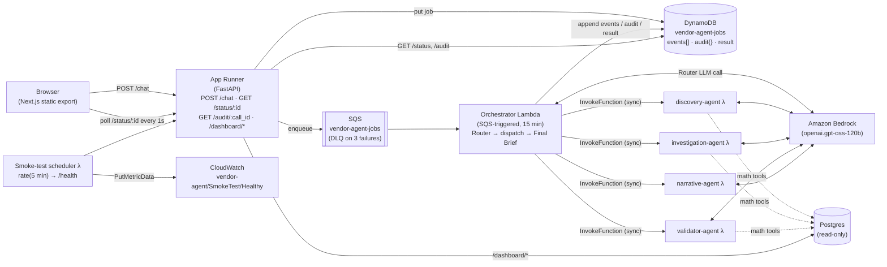

# Vendor Concentration — Agency 2026 (deployed)

Hackathon entry for **Challenge 5: Vendor Concentration**, packaged for
async deployment on AWS.

## Architecture

`POST /chat` enqueues a job and returns `{job_id}`. The frontend polls
`GET /status/:id` every ~1s and re-renders progress from the appended
`events[]` log written by the orchestrator and specialist Lambdas.



* **App Runner** — thin FastAPI service. `POST /chat` enqueues a job and
  returns `{job_id}`; `GET /status/:id` returns the appended event log
  plus the currently-active agent. Also serves the Next.js static export
  under `/` and the read-only `/dashboard/*` Postgres endpoints used by
  the homepage charts.
* **Orchestrator Lambda** — SQS-triggered, 15-min timeout. Runs the
  Router (one Bedrock call, no tools) inline, dispatches to specialist
  Lambdas (sequential pipeline for the `pipeline` route, single fan-out
  for the others), composes a deterministic Final Brief, writes
  everything into DynamoDB.
* **4 specialist Lambdas** — Discovery, Investigation, Validator,
  Narrative. Each builds the Strands agent it owns, runs it inside a
  `BufferedBus` (the Lambda analogue of the in-process EventBus), and
  returns `{parsed, raw_text, events, audit}` for the orchestrator to
  merge into the job record.
* **DynamoDB jobs table** — single hash key `job_id`, 24-hour TTL.
  Carries `events[]` (append-only log shaped exactly like the React
  layer's `ChatEvent`), `audit{}` (per-call_id math-tool blobs), and the
  final `result`.
* **SQS queue** — 910s visibility timeout (must exceed the orchestrator
  Lambda timeout); DLQ after 3 failed receives.
* **Smoke-test scheduler** — EventBridge schedule fires a Lambda every
  5 minutes. The Lambda pings `/health` and emits a CloudWatch metric
  (`vendor-agent/SmokeTest/Healthy`).

## Layout

```
agency-2026/
├── Dockerfile               App Runner image (pnpm build → static export, uv → uvicorn)
├── backend/
│   ├── server.py                       FastAPI (chat, status, audit, dashboards, static)
│   ├── pyproject.toml                  uv project for the App Runner image
│   ├── package_agents.py               builds linux/amd64 Lambda zips via Docker
│   ├── vendor_concentration_agent/     shared package — math, agents, tools, prompts, …
│   ├── orchestrator/handler.py         SQS entry; Router + dispatch + Final Brief
│   ├── discovery_agent/handler.py      thin wrapper over build_discovery_agent
│   ├── investigation_agent/handler.py
│   ├── validator_agent/handler.py
│   ├── narrative_agent/handler.py
│   └── scheduler/handler.py            CloudWatch smoke-test
├── frontend/                Next.js 16 app — `output: 'export'`, pnpm
├── references/              source-document registry (referenced by the validator)
├── terraform/               main.tf, variables.tf, terraform.tfvars.example
└── docs/                    architecture + judges briefing
```

## Agents

The system answers Challenge 5 — *"In any given category of government
spending, how many vendors are actually competing? Where has incumbency
replaced competition?"* — with a five-agent pipeline. Every agent is a
Strands `Agent` running on Amazon Bedrock; each has a tightly-scoped
prompt and a curated subset of deterministic math tools. Agents reason
about which tools to call; **the tools compute the numbers**. No agent
ever invents a figure.

See `docs/architecture.md` and `docs/judges-context.md` for the long
form: scoring rubric, sub-theme mapping, references discipline, and the
full validator-gates contract.

### Pipeline shape

```
USER QUESTION
   │
   ▼
ROUTER ────────────────────────────────────► out_of_scope / narration / single specialist
   │   (one LLM call, no tools)
   │
   ▼     ── pipeline route ──
DISCOVERY  →  INVESTIGATION  →  VALIDATOR  →  FINAL BRIEF (deterministic, no LLM)
```

- The **Router** runs inline inside the Orchestrator Lambda. The four
  **specialists** each live in their own Lambda and are invoked
  synchronously by the orchestrator (`lambda:InvokeFunction`).
- For the `pipeline` route the orchestrator runs Discovery →
  Investigation → Validator sequentially, threading each agent's
  `raw_text` into the next as conversational context, then composes a
  **Final Brief** deterministically from the three parsed JSON outputs.
- For the `discovery`, `investigation`, `validation`, or `narration`
  routes the orchestrator invokes only that one specialist.

### Per-agent responsibilities & tools

| Agent | Lives in | Job | Tools |
|---|---|---|---|
| **Router** | Orchestrator Lambda (inline) | Classify the question into one of 6 routes (`pipeline`, `discovery`, `investigation`, `validation`, `narration`, `out_of_scope`). | *None* — pure classification |
| **Discovery** | `discovery_agent` Lambda | Reframe the question into a measurable claim. Pick the dataset/category/dimension. Surface 3–5 candidate concentrated categories worth drilling into. Output: an investigation plan. | `list_top_concentrated_categories` |
| **Investigation** | `investigation_agent` Lambda | Compute the actual numbers. For each candidate from Discovery, run concentration metrics and surface the dominant vendor, its share, and how long it has held the category. Every figure carries its `tool_call_id` so the audit drawer can show the SQL + source rows. | `hhi_for_category`, `cr_n_for_category`, `gini_for_category`, `sole_source_share`, `how_long_has_vendor_held_category`, `vendor_full_footprint`, `how_many_distinct_vendors_in_category` |
| **Validator** | `validator_agent` Lambda | Cross-check Investigation's findings against a *second* source — sibling table (sole-source vs. competitive), cross-jurisdiction (AB ↔ FED ↔ open.canada.ca via `general.entity_match`), or finer-grained re-slice. Issue `MATCH` / `PARTIAL` / `DIVERGE` verdicts. Rule out by-design singletons (RCMP, Receiver General). | `cross_dataset_lookup_for_vendor`, `compare_two_computations`, `sole_source_share` *(deliberately NOT given the Investigation toolkit — letting Validator re-run HHI/CR_n with slightly different inputs would manufacture false DIVERGE verdicts)* |
| **Narrative** | `narrative_agent` Lambda | Write the plain-English brief for a non-technical Minister. Surface the "huh, that's interesting" line. Tag every finding with its sub-theme (Efficiency / Integrity / Alignment). Cite every number back to a `tool_call_id`. | *None* — writing only |

### The math layer (the trust boundary)

Every tool wraps a function in `backend/vendor_concentration_agent/math/`
that returns a `MathResult`:

```python
{
    "value":        <number>,
    "sql":          <string>,        # the exact query that produced it
    "source_rows":  [...],           # sample of underlying rows for audit
    "trace_steps":  [...],           # per-term arithmetic for the ⓘ popover
    "formula_id":   "hhi",           # key into math/explainers.py
    "references":   ["doj_hhi"],     # registry IDs (may be empty for pure counts)
}
```

| Module | Function | Computes | Reference |
|---|---|---|---|
| `math/concentration.py` | `hhi(category)` | Σ(market_shareᵢ)² over vendors | DOJ/FTC Horizontal Merger Guidelines §5.3 |
| `math/concentration.py` | `cr_n(category, n)` | Top-n combined share (CR1, CR4) | Standard industrial-org textbook |
| `math/concentration.py` | `gini(category)` | Inequality of contract value distribution | Statistics Canada Gini methodology |
| `math/procurement.py` | `sole_source_rate(scope)` | $ sole-source / $ total | Pure ratio |
| `math/procurement.py` | `incumbency_streak(vendor, category)` | Max consecutive fiscal years same vendor wins | Pure count |
| `math/procurement.py` | `vendor_footprint(vendor)` | Distinct (ministry, category) pairs | Pure count |
| `math/procurement.py` | `competition_count(category)` | Distinct vendors who ever won | Pure count |
| `math/crosscheck.py` | `cross_dataset_lookup(entity)` | Same entity totals across AB / FED / open.canada.ca via `general.entity_match` | — |
| `math/crosscheck.py` | `divergence_check(a, b)` | Δ% between two computations of "same" number | Pure arithmetic |

Postgres access is funnelled through one read-only helper
(`vendor_concentration_agent/data/postgres.py`); no agent or tool reaches
around it. **No invented metrics** — no `lockin_score`, no custom risk
indices. If a formula isn't in a textbook, government policy doc, or
standard methodology page, it doesn't ship.

### Cross-Lambda state — `BufferedBus`

Each specialist Lambda sets a `BufferedBus` on a contextvar before
running its agent. The Strands `@tool` wrappers in `tools/_wrap.py` push
math-tool cards (`tool` / `tool_result` / `tool_done` events) and audit
blobs (`{call_id → {sql, source_rows, …}}`) into the bus. After the
agent finishes, the Lambda dumps the bus and returns
`{parsed, raw_text, events, audit}`. The orchestrator merges those into
the DynamoDB job record so the polling frontend can render progress
agent-by-agent and tool-by-tool.

This is the Lambda analogue of the in-process `EventBus`. The React
layer's `ChatEvent` shape (`text` / `tool` / `tool_done` /
`tool_result`) is preserved exactly — the transport changed (SSE →
poll) but the event shape did not.

### Validator gates

Before the Final Brief is composed, the Validator runs three programmatic
checks. Failure on any check drops the offending claim or holds the
card back from display:

1. **Numeric sourcing** — every number has a `tool_call_id` resolving in
   this run's trace.
2. **Context sourcing** — every context claim has a `reference_id`
   resolving in `references/references.json` (URL responded 200, excerpt
   non-empty).
3. **Formula explainability** — every `formula_id` has a non-empty entry
   in `math/explainers.py`.

### Final Brief (deterministic)

`final_brief.py` composes the user-facing brief from the parsed
structured outputs of Discovery + Investigation + Validator. No LLM is
involved at this step, so it is impossible for the brief to introduce a
number or claim that wasn't already in a sourced agent output.

## Local development

```bash
# Backend
cp .env.example .env   # fill PG_DSN; AWS_* not needed for /dashboard
cd backend
uv sync
uv run uvicorn server:app --reload --port 8000

# Frontend (separate terminal)
cd frontend
pnpm install
NEXT_PUBLIC_BACKEND_URL=http://localhost:8000 pnpm dev
# http://localhost:3000
```

`POST /chat` requires `QUEUE_URL` + AWS creds for SQS — for pure
dashboard work it's optional. To exercise the chat path locally you'd
need to deploy the queue/Lambdas (or stub them in the orchestrator).

## Deploy

```bash
# 1. Build all Lambda zips (Docker required)
uv run backend/package_agents.py

# 2. Configure terraform vars
cd terraform
cp terraform.tfvars.example terraform.tfvars
$EDITOR terraform.tfvars      # set pg_dsn at minimum

# 3. Apply
terraform init
terraform apply
# Outputs: service_url, ecr_repository_url, jobs_table_name, queue_url
```

Subsequent code-only updates:

* **Lambda change**: re-run `uv run backend/package_agents.py` then
  `terraform apply`.
* **App Runner change**: `terraform apply` rebuilds + pushes the image
  (the docker_image resource has `no_cache = true`); App Runner has
  `auto_deployments_enabled = true` and picks it up from ECR.
