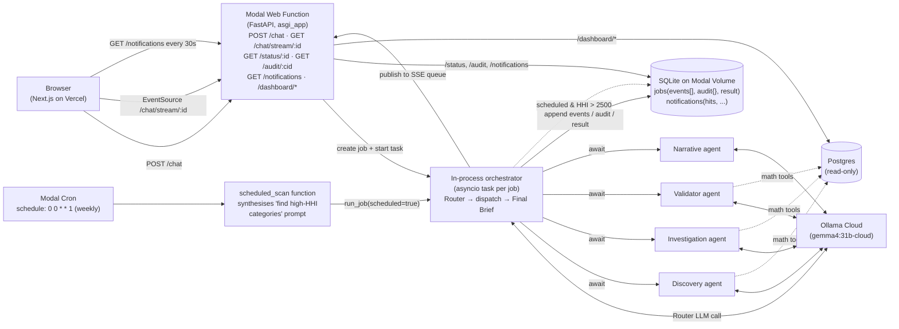

# Vendor Concentration — Agency 2026

Hackathon entry for **Challenge 5: Vendor Concentration**. Frontend on
Vercel, backend on Modal, Ollama Cloud for the LLM, and a read-only
Postgres for the procurement data.

## Technology stack

| Layer | Technology | Where it lives |
|---|---|---|
| Frontend | Next.js 16 (native, App Router) | `frontend/` |
| | React 19.2 + Tailwind CSS v4 + Radix UI | |
| | Recharts | dashboard charts |
| | pnpm 9 | package manager (never `npm`) |
| Frontend host | Vercel (Hobby) | Production tracks `deploy` branch |
| Backend (API) | FastAPI + uvicorn + Pydantic v2 | `backend/server.py` |
| | uv | Python project + lockfile manager (never `pip`) |
| Backend host | Modal — `@modal.asgi_app()` + `modal.Cron` | `backend/modal_deploy.py` |
| Agent runtime | Strands Agents SDK (`Agent`, `@tool`) | `vendor_concentration_agent/agents/` |
| | Python 3.12 `asyncio` | in-process orchestration; no queue, no broker |
| LLM (default) | Ollama Cloud — `gemma4:31b-cloud` | `LLM_PROVIDER=ollama` |
| LLM (legacy) | AWS Bedrock — `us.anthropic.claude-sonnet-4-6` | `LLM_PROVIDER=bedrock` (the AWS-variant path) |
| Job + notification store | SQLite on a Modal Volume | `vendor_concentration_agent/jobstore.py` |
| Source data | Render-hosted Postgres (read-only replica) | `data/postgres.py` (agent tools), `dashboards.py` (charts) |
| Postgres clients | `psycopg2` (agent math tools), `connectorx` + `polars` (dashboards) | |
| Transport | Server-Sent Events | browser `EventSource` ↔ `/chat/stream/:job_id` |
| IaC | None for `deploy`; archived Terraform retained for the AWS variant | `terraform/` |

## Architecture

`POST /chat` returns `{job_id}` and starts the orchestration as an
in-process asyncio task. The browser opens an `EventSource` on
`GET /chat/stream/:job_id` and renders progress as Server-Sent Events
arrive — same `ChatEvent` shape (`text` / `tool` / `tool_done` /
`tool_result`) the original SSE-from-funding-loops contract specified.
Job state is persisted to a SQLite file on a Modal Volume so `/status`,
`/audit`, and the notification-dossier modal can read historical jobs
on reconnect.


```mermaid
flowchart LR
    Browser["Browser<br/>(Next.js on Vercel)"]
    Modal["Modal Web Function<br/>(FastAPI, asgi_app)<br/>POST /chat · GET /chat/stream/:id<br/>GET /status/:id · GET /audit/:cid<br/>GET /notifications · /dashboard/*"]
    SQLite[("SQLite on Modal Volume<br/>jobs(events[], audit{}, result)<br/>notifications(hits, ...)")]
    Orch["In-process orchestrator<br/>(asyncio task per job)<br/>Router → dispatch → Final Brief"]
    Disc["Discovery agent"]
    Inv["Investigation agent"]
    Val["Validator agent"]
    Narr["Narrative agent"]
    PG[("Postgres<br/>(read-only)")]
    Ollama["Ollama Cloud<br/>(gemma4:31b-cloud)"]
    Cron["Modal Cron<br/>schedule: 0 0 * * 1 (weekly)"]
    ScanFn["scheduled_scan function<br/>synthesises 'find high-HHI<br/>categories' prompt"]

    Browser -- "POST /chat" --> Modal
    Browser -- "EventSource /chat/stream/:id" --> Modal
    Browser -- "GET /notifications every 30s" --> Modal
    Modal -- "create job + start task" --> Orch
    Orch <-- "Router LLM call" --> Ollama
    Orch -- "await" --> Disc
    Orch -- "await" --> Inv
    Orch -- "await" --> Val
    Orch -- "await" --> Narr
    Disc <--> Ollama
    Inv <--> Ollama
    Val <--> Ollama
    Narr <--> Ollama
    Disc -. "math tools" .-> PG
    Inv -. "math tools" .-> PG
    Val -. "math tools" .-> PG
    Orch -- "append events / audit / result" --> SQLite
    Orch -- "publish to SSE queue" --> Modal
    Orch -. "scheduled & HHI > 2500" .-> SQLite
    Modal -- "/status, /audit, /notifications" --> SQLite
    Modal -- "/dashboard/*" --> PG
    Cron --> ScanFn
    ScanFn -- "run_job(scheduled=true)" --> Orch
```

* **Vercel** — hosts the Next.js 16 frontend (native, not static export).
  Production tracks the `deploy` branch; preview deploys are created per
  PR. Browser talks directly to Modal via
  `NEXT_PUBLIC_BACKEND_URL=https://<workspace>--vendor-agent-web.modal.run`.
* **Modal Web function** — FastAPI app exposed as an `asgi_app`. Runs the
  orchestrator and all four specialist agents in a single Python
  process. `min_containers=1` keeps one warm so the demo doesn't
  cold-start on the first chat. `max_inputs=10` allows concurrent jobs
  on the same container.
* **In-process orchestrator** (`vendor_concentration_agent/orchestration.py`)
  — async pipeline. `POST /chat` enqueues a job and starts an
  `asyncio.create_task(run_job(...))`. The task awaits the Router, then
  the specialists in sequence, then composes a deterministic Final Brief.
  Everything runs in one Python process — no subprocesses, no broker.
* **SSE dispatch** — each active job has an in-memory `asyncio.Queue`.
  Events written to the SQLite store are also pushed to that queue.
  `GET /chat/stream/:id` first replays persisted events from SQLite
  (so reconnects see history), then tails the live queue.
* **SQLite jobstore** (`vendor_concentration_agent/jobstore.py`) — single
  file on a Modal Volume (`/data/vendor_agent.db`). Tables: `jobs`
  (`events`, `audit`, `active_agent`, `result`) and `notifications`.
* **Modal Cron** — weekly schedule (`0 0 * * 1`, Mon 00:00 UTC) calls
  `scheduled_scan`, which builds a synthetic *"find high-HHI categories"*
  prompt and runs the in-process orchestrator with `scheduled=True`.
  High-HHI hits land in the SQLite `notifications` table the bell polls.
  Cadence was throttled from hourly to weekly as a temporary cost
  control — flip the `schedule=` arg in `modal_deploy.py` to dial it
  back up.
* **Ollama Cloud** — single `OllamaModel` instance shared across the
  five Strands agents.

## Application architecture

The deployment diagram above shows *where* things run. This one shows
*what happens inside* the Modal container when a request lands — the
in-process flow from `POST /chat` through the Router, the four
specialists, the math layer, and back out over SSE.

```mermaid
flowchart TB
    Browser["Browser (Next.js on Vercel)"]

    subgraph App["Modal container — single Python process"]
        direction TB
        Chat["POST /chat<br/>(server.py)"]
        PCache[("Prompt cache<br/>SHA-256(message+context) → job_id<br/>1h TTL · 256 entries · in-process")]
        Job["run_job — asyncio task<br/>(orchestration.py)"]
        Queue[("Per-job<br/>asyncio.Queue")]
        Stream["GET /chat/stream/:id<br/>SSE — replay SQLite then tail queue"]

        Router["Router agent<br/>1 LLM call · no tools<br/>classifies into 6 routes"]
        D["Discovery"]
        I["Investigation"]
        V["Validator"]
        N["Narrative<br/>(paraphrase mode)"]
        FB["build_final_brief<br/>deterministic template"]

        Wrap["@tool wrappers<br/>tools/_wrap.py"]
        Bus["BufferedBus<br/>contextvar per agent"]
        Math["Math layer<br/>hhi · cr_n · gini · sole_source<br/>incumbency · footprint · cross-check"]
    end

    SQLite[("SQLite on Modal Volume<br/>jobs · notifications · dashboard_cache")]
    PG[("Render Postgres<br/>read-only replica")]
    Ollama["Ollama Cloud<br/>gemma4:31b-cloud"]
    Cron["Modal Cron<br/>scheduled_scan (weekly)"]

    Browser -- "POST /chat" --> Chat
    Browser -- "EventSource" --> Stream
    Chat --> PCache
    PCache -- "hit · reuse job_id" --> Stream
    PCache -- "miss" --> Job
    Job --> Queue
    Job --> Router
    Router -- "pipeline route" --> D
    Router -. "single route" .-> I
    Router -. .-> V
    Router -. .-> N
    D --> I --> V --> N --> FB

    Router <-- "LLM" --> Ollama
    D <-- "LLM" --> Ollama
    I <-- "LLM" --> Ollama
    V <-- "LLM" --> Ollama
    N <-- "LLM" --> Ollama

    D -. "tool call" .-> Wrap
    I -. "tool call" .-> Wrap
    V -. "tool call" .-> Wrap
    Wrap --> Math
    Math --> PG
    Wrap -- "push events + audit" --> Bus
    Bus -- "merge after agent" --> SQLite
    Bus -- "publish live" --> Queue
    FB -- "tool_result + paraphrase text" --> Queue

    Stream <-- "replay history" --> SQLite
    Stream <-- "tail live" --> Queue

    Cron -- "run_job(scheduled=True)" --> Job
```

**Reading the flow:**

1. **Request hits `POST /chat`.** `server.py` hashes `(message, context)`
   and looks up the prompt cache. On hit, the existing `job_id` is
   returned and the browser's `EventSource` replays the persisted
   events out of SQLite — no LLM, no DB, sub-100 ms answer.
2. **On a miss**, a new `job_id` is minted, the SQLite job row is
   created, an `asyncio.Queue` is registered, and `run_job` is launched
   as an `asyncio.create_task`. The browser opens its `EventSource`
   immediately and starts seeing events.
3. **The Router** runs inline — one LLM call, no tools — and writes
   its `tool` / `tool_result` / `tool_done` events. It chooses one of
   six routes (`pipeline`, `discovery`, `investigation`, `validation`,
   `narration`, `out_of_scope`).
4. **For the `pipeline` route**, Discovery → Investigation → Validator
   run sequentially, each one's `raw_text` threaded into the next as
   context. Narrative runs in **paraphrase mode** over the three
   structured outputs. `build_final_brief` then templates the brief
   deterministically and slots the paraphrase into the `summary` field.
5. **Inside each specialist**, a `BufferedBus` is set on a contextvar
   so the Strands `@tool` wrappers (`tools/_wrap.py`) push math-tool
   cards and audit blobs into it as the agent reasons. The wrappers
   call into the deterministic **math layer** (`hhi`, `cr_n`, `gini`,
   `sole_source_rate`, `incumbency_streak`, `vendor_footprint`,
   `cross_dataset_lookup`, …), which hits Postgres through one
   read-only `psycopg2` helper. Nothing else reaches the DB on the
   agent path.
6. **After each agent finishes**, the bus is dumped into the SQLite
   job record *and* published onto the per-job queue. The SSE
   consumer drains both: persisted history first, then live tail
   until the orchestrator emits its terminal `status` event.
7. **Scheduled scans** call the exact same `run_job` with
   `scheduled=True`; on a Final Brief whose `metrics_table` carries
   an HHI > 2500, `_maybe_notify` writes a row into the SQLite
   `notifications` table, which the navbar bell polls every 30 s.

The math layer is the trust boundary. Every tool returns a `MathResult`
record (`value`, `sql`, `source_rows`, `trace_steps`, `formula_id`,
`references`) — agents reason about which tools to call, the tools
compute the numbers, the deterministic templater composes the brief.
**Agents never invent a figure.**

## Caching

Four cache layers operate independently in front of the things that are
slow: the LLM (Ollama Cloud), Postgres, and cold containers. Hits at
each layer are answered from progressively cheaper sources.

| # | Cache | Where it lives | TTL | Survives | Used by |
|---|---|---|---|---|---|
| 1 | **Prompt cache** | in-process dict, `server.py` | 1 h (256 entries, LRU on overflow) | not container restarts (lookup falls back to SQLite job state on miss) | `POST /chat` — re-asking the same `(message, context)` returns the prior `job_id` |
| 2 | **Dashboard L1** | in-process dict, `dashboards.cached_dashboard` | 1 h | not container restarts | every `/dashboard/*` endpoint |
| 3 | **Dashboard L2** | SQLite `dashboard_cache` table on the Modal Volume | 1 h | rolling deploys + container restarts | every `/dashboard/*` endpoint |
| 4 | **Browser cache** | `Cache-Control: public, max-age=3600, stale-while-revalidate=86400` | 1 h fresh, 24 h SWR | any browser reload | every `/dashboard/*` response |
| — | **Lifespan pre-warm** | `server._prewarm_dashboards()` | one-shot on container boot | n/a | populates L1 (which can be served from L2 on a warm Volume), so the first user after a deploy doesn't pay Postgres latency |

Read order on `/dashboard/*`: **browser → L1 → L2 → Postgres**. Writes
populate both L1 and L2. The prompt cache is independent — it points
at the SQLite `jobs` row, which is the actual answer store.

### Job and notification TTLs

Not strictly caches, but related — the SQLite store enforces TTLs on
expensive rows so the Volume stays small:

- `jobs` — 24 h (`sweep_expired_jobs()` runs opportunistically off
  read paths, no separate cron).
- `notifications` — 7 days (filtered at read time in
  `list_notifications`).

### Why each layer exists

- **Prompt cache** — judges asking the same demo question twice should
  see the second answer instantly without spending another LLM call.
  Keyed by SHA-256, so context-sensitive (same question with different
  prior context is a miss).
- **Dashboard L1** — heavy CTE queries against Render Postgres take
  hundreds of milliseconds; an in-process dict makes them effectively
  free for the lifetime of the container.
- **Dashboard L2** — Modal containers come and go on rolling deploys.
  Without L2, the first user after every deploy pays the full Postgres
  latency on every chart. SQLite on the same Volume the jobstore uses
  keeps the warm state across restarts.
- **Browser cache** — chart payloads are stable for the day; the
  browser disk cache means warm reloads don't even hit the backend.
  `stale-while-revalidate` lets the cached chart render instantly
  while the new one is fetched in the background.
- **Pre-warm** — on lifespan startup, every `/dashboard/*` endpoint
  with default args is called once so L1 is hot before the first
  user request lands. Per-endpoint failures are logged and ignored
  so one flaky chart can't block the boot.

## Layout

```
agency-2026/
├── backend/
│   ├── server.py                       FastAPI — chat, SSE stream, status, audit, dashboards
│   ├── modal_deploy.py                 Modal entrypoint — asgi_app + scheduled_scan cron
│   ├── pyproject.toml                  uv project; deps include strands-agents, ollama, modal
│   └── vendor_concentration_agent/
│       ├── orchestration.py            in-process Router → specialists → Final Brief
│       ├── jobstore.py                 SQLite-backed JobSink + read helpers
│       ├── agents/_base.py             shared_model() — Ollama Cloud client
│       ├── agents/{router,discovery,investigation,validator,narrative}.py
│       ├── math/                       deterministic formulas (HHI, CR_n, Gini, …)
│       ├── tools/_wrap.py              Strands @tool wrappers — emit cards into the BufferedBus
│       ├── prompts/*.md                per-agent system prompts
│       └── data/postgres.py            single read-only DSN helper
├── frontend/                           Next.js 16 — native build, deployed to Vercel
├── references/                         source-document registry (read by validator)
└── docs/
    ├── architecture.md                 long-form analytical design
    └── judges-context.md               sub-theme mapping, scoring rubric
```

## Agents

The system answers Challenge 5 — *"In any given category of government
spending, how many vendors are actually competing? Where has incumbency
replaced competition?"* — with a five-agent pipeline. Every agent is a
Strands `Agent` running on Ollama Cloud; each has a tightly-scoped
prompt and a curated subset of deterministic math tools. Agents reason
about which tools to call; **the tools compute the numbers**. No agent
ever invents a figure.

See `docs/architecture.md` and `docs/judges-context.md` for the long
form: scoring rubric, sub-theme mapping, references discipline, and the
full validator-gates contract.

### Pipeline shape

```
USER QUESTION
   │
   ▼
ROUTER ────────────────────────────────────► out_of_scope / narration / single specialist
   │   (one LLM call, no tools)
   │
   ▼     ── pipeline route ──
DISCOVERY  →  INVESTIGATION  →  VALIDATOR  →  NARRATIVE  →  FINAL BRIEF
                                              (paraphrase   (deterministic
                                               only)         JSON template)
```

- The **Router** runs first inside `run_job`. The four **specialists**
  run as in-process awaits in the same asyncio task — no separate
  workers, no IPC.
- For the `pipeline` route the orchestrator runs Discovery →
  Investigation → Validator sequentially, threading each agent's
  `raw_text` into the next as conversational context. Once the
  Validator's verdict lands, the orchestrator awaits Narrative in
  **paraphrase mode** with the three structured outputs and the
  user's original question; Narrative returns
  `{"summary": "<2-3 sentences>"}` constrained to use only values
  that already appear in the upstream JSON. The orchestrator then
  composes a **Final Brief** by templating the structured outputs
  deterministically and slotting Narrative's paraphrase in as the
  brief's `summary` field. The orchestrator also appends the
  paraphrase as a plain `text` event after the Final Brief card so
  it reads as flowing prose at the bottom of the chat. If the
  Narrative call fails, the brief falls back to a mechanical summary
  so the pipeline still ships an answer.
- For the `discovery`, `investigation`, `validation`, or `narration`
  routes the orchestrator runs only that one specialist (Narrative
  on the standalone `narration` route runs free-form, not in
  paraphrase mode).

### Per-agent responsibilities & tools

| Agent | Role | Job | Tools |
|---|---|---|---|
| **Router** | inline in `run_job` | Classify the question into one of 6 routes (`pipeline`, `discovery`, `investigation`, `validation`, `narration`, `out_of_scope`). | *None* — pure classification |
| **Discovery** | `build_discovery_agent` | Reframe the question into a measurable claim. Pick the dataset/category/dimension. Surface 3–5 candidate concentrated categories worth drilling into. Output: an investigation plan. | `list_top_concentrated_categories` |
| **Investigation** | `build_investigation_agent` | Compute the actual numbers. For each candidate from Discovery, run concentration metrics and surface the dominant vendor, its share, and how long it has held the category. Every figure carries its `tool_call_id` so the audit drawer can show the SQL + source rows. | `hhi_for_category`, `cr_n_for_category`, `gini_for_category`, `sole_source_share`, `how_long_has_vendor_held_category`, `vendor_full_footprint`, `how_many_distinct_vendors_in_category` |
| **Validator** | `build_validator_agent` | Cross-check Investigation's findings against a *second* source — sibling table (sole-source vs. competitive), cross-jurisdiction (AB ↔ FED ↔ open.canada.ca via `general.entity_match`), or finer-grained re-slice. Issue `MATCH` / `PARTIAL` / `DIVERGE` verdicts. Rule out by-design singletons (RCMP, Receiver General). | `cross_dataset_lookup_for_vendor`, `compare_two_computations`, `sole_source_share` *(deliberately NOT given the Investigation toolkit — letting Validator re-run HHI/CR_n with slightly different inputs would manufacture false DIVERGE verdicts)* |
| **Narrative** | `build_narrative_agent` | Two modes. **Paraphrase mode** (pipeline route): given the user's question + Discovery / Investigation / Validator structured outputs, emit a 2–3 sentence summary that answers the question using only values already present in those outputs — no new numbers, names, percentages, or claims. **Narration mode** (standalone `narration` route): re-explain a prior finding in plain English when the user explicitly asks. | *None* — writing only |

### The math layer (the trust boundary)

Every tool wraps a function in `backend/vendor_concentration_agent/math/`
that returns a `MathResult`:

```python
{
    "value":        <number>,
    "sql":          <string>,        # the exact query that produced it
    "source_rows":  [...],           # sample of underlying rows for audit
    "trace_steps":  [...],           # per-term arithmetic for the ⓘ popover
    "formula_id":   "hhi",           # key into math/explainers.py
    "references":   ["doj_hhi"],     # registry IDs (may be empty for pure counts)
}
```

| Module | Function | Computes | Reference |
|---|---|---|---|
| `math/concentration.py` | `hhi(category)` | Σ(market_shareᵢ)² over vendors | DOJ/FTC Horizontal Merger Guidelines §5.3 |
| `math/concentration.py` | `cr_n(category, n)` | Top-n combined share (CR1, CR4) | Standard industrial-org textbook |
| `math/concentration.py` | `gini(category)` | Inequality of contract value distribution | Statistics Canada Gini methodology |
| `math/procurement.py` | `sole_source_rate(scope)` | $ sole-source / $ total | Pure ratio |
| `math/procurement.py` | `incumbency_streak(vendor, category)` | Max consecutive fiscal years same vendor wins | Pure count |
| `math/procurement.py` | `vendor_footprint(vendor)` | Distinct (ministry, category) pairs | Pure count |
| `math/procurement.py` | `competition_count(category)` | Distinct vendors who ever won | Pure count |
| `math/crosscheck.py` | `cross_dataset_lookup(entity)` | Same entity totals across AB / FED / open.canada.ca via `general.entity_match` | — |
| `math/crosscheck.py` | `divergence_check(a, b)` | Δ% between two computations of "same" number | Pure arithmetic |

Postgres access is funnelled through one read-only helper
(`vendor_concentration_agent/data/postgres.py`); no agent or tool reaches
around it. **No invented metrics** — no `lockin_score`, no custom risk
indices. If a formula isn't in a textbook, government policy doc, or
standard methodology page, it doesn't ship.

### In-process state — `BufferedBus`

Each specialist sets a `BufferedBus` on a contextvar before its agent
runs (via `run_specialist_async` in `lambda_runtime.py`). The Strands
`@tool` wrappers in `tools/_wrap.py` push math-tool cards (`tool` /
`tool_result` / `tool_done` events) and audit blobs
(`{call_id → {sql, source_rows, …}}`) into the bus. After the agent
finishes, `run_specialist_async` dumps the bus and returns
`{parsed, raw_text, events, audit}`. The orchestrator merges those into
the SQLite job record *and* publishes them onto the per-job
`asyncio.Queue` so SSE consumers see them in real time.

The React layer's `ChatEvent` shape (`text` / `tool` / `tool_done` /
`tool_result`) is the source of truth — `lib/api.ts` decodes the SSE
stream into these events and `ChatDrawer` renders them.

### Validator gates

Before the Final Brief is composed, the Validator runs three programmatic
checks. Failure on any check drops the offending claim or holds the
card back from display:

1. **Numeric sourcing** — every number has a `tool_call_id` resolving in
   this run's trace.
2. **Context sourcing** — every context claim has a `reference_id`
   resolving in `references/references.json` (URL responded 200, excerpt
   non-empty).
3. **Formula explainability** — every `formula_id` has a non-empty entry
   in `math/explainers.py`.

### Final Brief (deterministic structure, LLM-paraphrased summary)

`final_brief.py` composes the user-facing brief from the parsed
structured outputs of Discovery + Investigation + Validator. The
brief's `headline`, `metrics_table`, `verdict`, `confidence`,
`recommendation`, and `caveats` are templated by pure Python — no LLM
involved at that step, so those fields can never carry a number or
claim that wasn't already in a sourced agent output.

The `summary` field is the one exception: it comes from Narrative's
paraphrase pass, which is given the three structured outputs as JSON
and instructed to use only values that appear verbatim there. If the
paraphrase call fails for any reason, `final_brief.py` falls back to
a mechanical sentence assembled from metric counts and the verdict —
the brief always ships with *some* summary.

## Auto-scan & notifications

The same agent pipeline that answers user questions also runs
proactively on a weekly Modal Cron, scanning for high-concentration
categories without being asked. (The cadence is a temporary cost
control — see the Modal Cron bullet above.)

### Flow

```
Modal Cron (0 0 * * 1, Mon 00:00 UTC)
       │
       ▼
scheduled_scan function
       │  builds prompt:
       │    "Scan the procurement dataset and identify the top 3
       │     categories with the highest vendor concentration (HHI) …"
       │
       ▼
run_job(scheduled=True)  (same code path as user chat)
       │  Router → Discovery → Investigation → Validator → Narrative → Final Brief
       │
       ▼
_maybe_notify():
  if scheduled AND brief.metrics_table contains an HHI metric > 2500:
      sink.save_notification({...})  →  SQLite notifications table
       │
       ▼
GET /notifications  ←  navbar bell polls every 30s
       │
       ▼
clicking a notification → "case dossier" modal with the headline,
                          paraphrased summary, hits, cross-checks,
                          and recommended action
```

The auto-scan reuses every part of the user pipeline — the Validator
still gates on cross-checks, the Narrative still paraphrases, the
Final Brief still composes deterministically. The only differences:

- The triggering message is synthesised by the `scheduled_scan` Modal
  function, not typed by a user.
- `run_job` is called with `scheduled=True`, which gates the
  notification write at the end of the pipeline.
- Notifications are filtered to high-HHI hits *only* — a clean run
  with no concentrations over the DOJ threshold writes nothing.

### Notifications table

SQLite schema (`notifications`):

```sql
CREATE TABLE notifications (
    notification_id  TEXT PRIMARY KEY,
    source_job_id    TEXT,             -- trace back to jobs.events / audit
    created_at       TEXT NOT NULL,    -- ISO 8601 UTC
    question         TEXT,             -- the synthetic prompt
    headline         TEXT,             -- from final_brief
    summary          TEXT,             -- Narrative paraphrase
    verdict          TEXT,             -- MATCH | PARTIAL | DIVERGE | INSUFFICIENT_DATA
    confidence       TEXT,             -- high | medium | low
    sub_theme        TEXT,             -- Efficiency | Integrity | Alignment
    hits             TEXT NOT NULL     -- JSON [{metric, value, interpretation, call_id}]
);
```

`list_notifications()` filters out rows older than 7 days at read time;
`sweep_expired_jobs()` is called opportunistically to keep the file lean.

### Frontend surfaces

The navbar bell (`components/layout/NotificationsBell.tsx`):

- Polls `GET /notifications` every 30 seconds.
- Renders an unread badge with a pulse animation when any
  notification's `created_at` is newer than the locally-stored
  `last-seen` timestamp (`localStorage.agency2026.notifications.last-seen`).
- Opens a portalled panel with a header that explains the pipeline
  cadence and the trigger threshold, plus a list of recent
  notifications.

Clicking a row opens a **case dossier** modal
(`components/layout/NotificationDetailModal.tsx`) — verdict-coloured
accent bar, hero header (sub-theme kicker, dossier ID, headline,
metadata strip, verdict/confidence/hit pills), and sections for
trigger, summary, primary finding, cross-checks, recommended action,
and similar categories elsewhere. Some enrichment fields are still
deterministic dummies keyed off the notification ID.

### Extending beyond the in-app bell

`save_notification()` writes to SQLite; production deployments would
typically fan out to one or more of:

| Channel | How |
|---|---|
| Slack | `httpx.post(SLACK_WEBHOOK_URL, json={...})` next to the SQLite write |
| Email | Resend / Postmark / SES, called from the same path |
| Browser push | `Notification.requestPermission()` in the bell + tie `new Notification(...)` to the poll loop |
| Daily digest | a second `@app.function(schedule=modal.Cron("0 9 * * *"))` that reads the table and composes a single email |

## Local development

```bash
# Backend
cp .env.example .env   # set OLLAMA_CLOUD_API_KEY and PG_DSN
cd backend
uv sync
uv run uvicorn server:app --reload --port 8000

# Frontend (separate terminal)
cd frontend
pnpm install
NEXT_PUBLIC_BACKEND_URL=http://localhost:8000 pnpm dev
# http://localhost:3000
```

The local backend uses the same SQLite store (file at
`backend/vendor_agent.db`, gitignored). The chat path runs end-to-end
locally as long as `OLLAMA_CLOUD_API_KEY` and `PG_DSN` are set.

## Deploy

### Backend → Modal

```bash
cd backend

# First time: authenticate
uv run modal token new

# Create the secret (or update via the dashboard at modal.com/secrets)
uv run modal secret create vendor-agent \
    LLM_PROVIDER=ollama \
    LLM_MODEL=gemma4:31b-cloud \
    OLLAMA_HOST=https://ollama.com \
    OLLAMA_CLOUD_API_KEY=... \
    PG_DSN='postgresql://...' \
    CORS_ORIGINS='https://your-app.vercel.app'

# Deploy
uv run modal deploy modal_deploy.py
# Outputs a URL like:
#   https://<workspace>--vendor-agent-web.modal.run
```

Subsequent code-only updates: `uv run modal deploy modal_deploy.py`
again. Logs: `uv run modal app logs vendor-agent`. Manual cron run:
`uv run modal run modal_deploy.py::scheduled_scan`.

### Frontend → Vercel

- Import `s-sajid/agency-2026` at https://vercel.com/new
- Root Directory: `frontend`
- Environment variable: `NEXT_PUBLIC_BACKEND_URL` = the Modal web URL
- Settings → Environments → Production → Branch Tracking: `deploy`

Production tracks `deploy`; previews are auto-created per push. After
the first Vercel deploy, update the Modal `vendor-agent` secret's
`CORS_ORIGINS` to the production Vercel URL and redeploy the backend.
