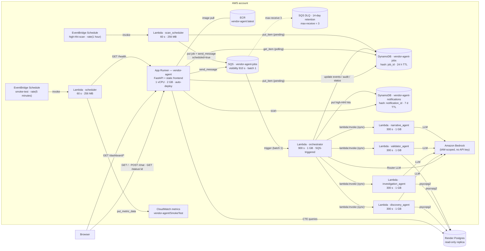
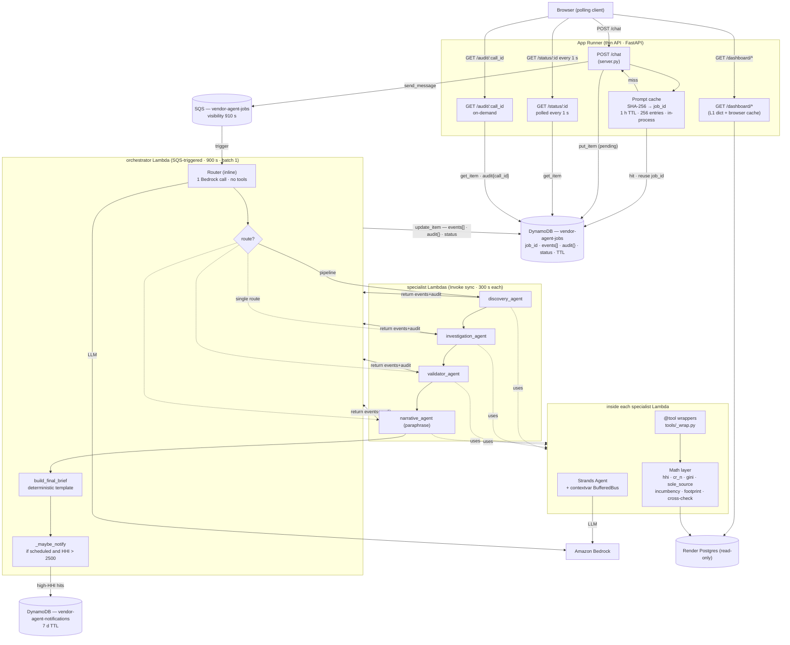

# AWS Architecture — Vendor Concentration (`main` branch)

> Snapshot of the AWS topology that ships on the **`main` branch** —
> App Runner thin API + DynamoDB + SQS + Lambda fan-out + Bedrock +
> EventBridge Scheduler, all deployed via Terraform.
>
> The live `deploy` branch (see `README.md`) is a free-tier
> Modal/Vercel/Ollama Cloud port that preserves the same agent design.
> If you're presenting on the AWS version, this doc is the one. The
> agent-level architecture (Router → D → I → V → N → Final Brief, math
> layer, references discipline, validator gates) is identical across
> both branches — only the substrate differs.

## Technology stack

| Layer | Technology | Where it's wired |
|---|---|---|
| Frontend | Next.js 16 (static export, App Router) | `frontend/` — built by the Dockerfile's first stage |
| | React 19.2 + Tailwind CSS v4 + Radix UI + Recharts | |
| | pnpm 9 | package manager |
| Frontend host | **Same App Runner container** — Next.js `out/` mounted at `/` as `StaticFiles` | `Dockerfile` layer 3 + `backend/server.py:265-267` |
| Backend (thin API) | FastAPI + uvicorn + Pydantic v2 | `backend/server.py` |
| | boto3 (SQS, DynamoDB, CloudWatch clients) | |
| | uv | Python project + lockfile manager |
| Backend host | **AWS App Runner** — 1 vCPU, 2 GB RAM, ECR-sourced image | `terraform/main.tf` → `aws_apprunner_service.app` |
| Container registry | **Amazon ECR** (private) | image built + pushed by the `docker_image` + `docker_registry_image` Terraform resources |
| Agent runtime | **AWS Lambda** (Python 3.12) — 1 orchestrator + 4 specialists | `backend/orchestrator/`, `backend/{discovery,investigation,validator,narrative}_agent/` |
| | Strands Agents SDK (`Agent`, `@tool`, `BedrockModel`) | `vendor_concentration_agent/agents/` |
| LLM | **Amazon Bedrock** — Claude Sonnet / `openai.gpt-oss-120b-1:0` (Terraform default) | IAM-scoped, no API key — `bedrock:InvokeModel*` on each Lambda role |
| Job queue | **Amazon SQS** — `vendor-agent-jobs`, visibility 910 s, DLQ at 3 retries | `aws_sqs_queue.jobs` + `aws_sqs_queue.jobs_dlq` |
| Job store | **Amazon DynamoDB** — `vendor-agent-jobs`, PAY_PER_REQUEST, `ttl` enabled (24 h) | `aws_dynamodb_table.jobs` |
| Notification store | **Amazon DynamoDB** — `vendor-agent-notifications`, PAY_PER_REQUEST, `ttl` enabled (7 d) | `aws_dynamodb_table.notifications` |
| Schedulers | **EventBridge Scheduler** — `smoke-test` `rate(5 minutes)`, `high-hhi-scan` `rate(1 hour)` | `aws_scheduler_schedule.{smoke_test,high_hhi_scan}` |
| Observability | **CloudWatch** custom metrics — `vendor-agent/SmokeTest` namespace (`Healthy`, `LatencyMs`) | `backend/scheduler/handler.py` |
| Source data | **Render-hosted Postgres** (read-only replica) — outside AWS | `PG_DSN` passed to App Runner + every agent Lambda |
| Postgres clients | `psycopg2` (agent math tools), `connectorx` + `polars` (dashboards) | |
| Transport | **Polling** — browser hits `GET /status/:id` every 1 s | `frontend/lib/api.ts:pollChat` |
| IaC | **Terraform** (`hashicorp/aws` + `kreuzwerker/docker` providers) | `terraform/main.tf` |

## Deployment topology



**Key points:**

- **App Runner is intentionally thin.** It writes a pending job to
  DynamoDB, drops the job ID onto SQS, and returns. No agent code runs
  in the App Runner container — it's just a request shim plus the
  dashboard routes (which do read Postgres directly).
- **The orchestrator is the only SQS consumer.** Lambda's event source
  mapping pulls one message at a time (`batch_size = 1`) so failures
  surface as one job, not a batch. SQS visibility (910 s) is set just
  above the orchestrator's 900 s Lambda timeout — a crashed worker
  re-becomes-visible automatically, with the DLQ catching anything that
  re-fails 3 times.
- **Specialists are invoked synchronously.** The orchestrator does
  `lambda.invoke(..., InvocationType="RequestResponse")` and waits.
  This is what lets the orchestrator merge the per-specialist
  `events[]` and `audit{}` into one DynamoDB job item in the same
  flow.
- **Two EventBridge schedules.** `smoke-test` (every 5 min) pings
  App Runner `/health` and writes a CloudWatch metric so you can alarm
  on outages. `high-hhi-scan` (hourly) enqueues a synthetic scan job
  onto the *same* SQS queue the chat uses — zero duplicated agent
  code; the only difference is the `scheduled=True` flag, which gates
  the `notifications` write at the end of the pipeline.
- **All AWS state is managed by Terraform.** `terraform apply` builds
  the Docker image, pushes to ECR, and stands up App Runner, SQS+DLQ,
  both DynamoDB tables, six Lambdas, two schedules, plus the IAM
  roles for each (App Runner instance role, four specialist Lambdas,
  orchestrator, two scheduler Lambdas, and the two EventBridge invoke
  roles).

## Application architecture

The same agent design as the `deploy` branch — Router → Discovery →
Investigation → Validator → Narrative → Final Brief — runs across
**five Lambdas** instead of one Python process. State that lived in
an in-process queue on Modal lives in DynamoDB here, and the SSE
stream that browsers consume there is replaced by 1-second polling
on `GET /status/:id`.



**Reading the flow:**

1. **`POST /chat` lands on App Runner.** `server.py` SHA-256-hashes
   `(message, context)`, checks the in-process prompt cache, and on
   hit returns the prior `job_id` immediately (the browser then polls
   `/status/:id` and gets the cached terminal result on the next tick).
   On miss it `put_item`s a pending job row, `send_message`s onto SQS,
   and returns the new `job_id`.
2. **The browser starts polling.** `lib/api.ts:pollChat` re-issues
   `GET /status/:id` every 1 s. Each response carries the full
   `events[]` array and the current `active_agent`; the client tracks a
   cursor so duplicate events are skipped on re-poll.
3. **SQS triggers the orchestrator Lambda** (`batch_size = 1`,
   visibility 910 s). The Router runs inline — one Bedrock call, no
   tools — and the orchestrator appends its three events
   (`tool`, `tool_result`, `tool_done`) to the DynamoDB job item.
4. **For the `pipeline` route**, the orchestrator synchronously invokes
   Discovery → Investigation → Validator → Narrative via
   `lambda:Invoke RequestResponse`. Each specialist returns
   `{parsed, raw_text, events, audit}`; the orchestrator merges those
   into the DynamoDB job item via `list_append` (events) and
   `audit.<call_id> = …` (audit map).
5. **Inside each specialist Lambda**, the same `BufferedBus`-on-a-
   contextvar pattern as on Modal applies: Strands `@tool` wrappers
   push math-tool cards and audit blobs into the bus while the agent
   reasons; after the agent finishes, `run_specialist` in
   `lambda_runtime.py` dumps the bus into the Lambda's return value.
6. **`build_final_brief` runs inside the orchestrator Lambda.** The
   Narrative paraphrase fills the `summary` field; everything else is
   templated deterministically. The Final Brief card and the paraphrase
   text event are appended to DynamoDB in one update.
7. **`_maybe_notify`** — if the orchestrator was invoked with
   `scheduled=True` (i.e. via the scan_scheduler path) *and* the brief
   carries an HHI metric > 2500, a row is written to the
   `notifications` table. The frontend's bell polls `GET /notifications`
   every 30 s to surface those.

## Transport: polling

`POST /chat` returns `{job_id}` synchronously after the SQS enqueue.
The frontend then opens a polling loop on `GET /status/:id` at 1 s
intervals (`POLL_MS = 1000` in `frontend/lib/api.ts`). Each response
shape:

```
{
  job_id,
  status: "pending" | "running" | "complete" | "error",
  events: [...],          // append-only list, same ChatEvent shape
  active_agent: [...],    // who's running right now
  result, route, error
}
```

The client maintains a cursor into `events[]` so each poll only emits
the *new* events to `ChatDrawer`. `status === "complete"` or `"error"`
terminates the loop.

**Why polling?** App Runner serves long-lived connections, but Lambda
doesn't — and the agent work runs in Lambda. Moving job state into
DynamoDB makes the system stateless at the API tier; any App Runner
instance can answer any `/status/:id` request. The trade-off vs. SSE
is one DynamoDB `GetItem` per second per active chat — cheap on
PAY_PER_REQUEST, and the events are append-only so the response
payload is monotonic.

## Reliability

| Concern | Mechanism |
|---|---|
| Worker crash mid-job | SQS visibility (910 s) expires the in-flight message; another Lambda invocation re-receives it. The orchestrator's DynamoDB writes are idempotent by `job_id`. |
| Repeated failure | DLQ kicks in after 3 receive attempts (`max_receive_count = 3` on the redrive policy); messages sit in `vendor-agent-jobs-dlq` for 14 days for inspection. |
| Lambda cold start | Lambdas are sized 1 GB / 300 s (specialists) and 1 GB / 900 s (orchestrator). Cold starts cost a few seconds; the polling UI hides this behind the `running` state. |
| Stale jobs | DynamoDB TTL on the `ttl` attribute (24 h for jobs, 7 d for notifications) — set at write time in `server.py:184` and `orchestrator/handler.py:253`. |
| Region | Single-region (default `us-west-2`, settable via `var.region`). |

## Auto-scan + smoke test

Two EventBridge schedules drive proactive work, independent of users:

1. **`high-hhi-scan` — `rate(1 hour)`** → invokes the **`scan_scheduler`
   Lambda** (60 s / 256 MB). It builds a synthetic *"find any category
   with an HHI above 2500"* prompt, writes a `pending` job row to
   DynamoDB with `scheduled: true`, and `send_message`s onto the same
   SQS queue user chats use. The orchestrator picks it up, runs the
   full pipeline, and `_maybe_notify` writes a row to the notifications
   table on a high-HHI hit. Same agent code, no duplication.
2. **`smoke-test` — `rate(5 minutes)`** → invokes the **`scheduler`
   Lambda** (60 s / 256 MB). It curls App Runner's `/health` endpoint
   and publishes `Healthy` (0 / 1) and `LatencyMs` to the CloudWatch
   namespace `vendor-agent/SmokeTest`. Alarms can be wired to those
   metrics for incident notification.

## Caching

Three cache layers on the AWS path:

| # | Cache | Where | TTL | Survives |
|---|---|---|---|---|
| 1 | **Prompt cache** | in-process dict on each App Runner instance (`server.py:_chat_cache`) | 1 h (256 entries · LRU on overflow) | not container restarts; lookup falls back to DDB to confirm the cached `job_id` is still in a terminal state |
| 2 | **Dashboard L1** | in-process dict, `dashboards.cached_dashboard` | 5 minutes (TTL on `main`) | not container restarts |
| 3 | **Browser cache** | `Cache-Control: public, max-age=300` on `/dashboard/*` | 5 minutes | any browser reload |

DynamoDB itself acts as the durable answer store — repeated polls hit
DDB, not the agents. App Runner scales 1 instance for the hackathon
footprint, so the in-process caches are effectively process-global.

## IAM topology (one role per concern)

- **`apprunner_ecr_access`** — `AWSAppRunnerServicePolicyForECRAccess`.
- **`apprunner_instance`** — `sqs:SendMessage` on the jobs queue,
  `dynamodb:GetItem/PutItem/UpdateItem/Query/Scan` on both tables.
- **`lambda_specialist`** — `AWSLambdaBasicExecutionRole` + scoped
  `bedrock:InvokeModel*`. Shared by all four specialist Lambdas.
- **`lambda_orchestrator`** — `AWSLambdaBasicExecutionRole`,
  `sqs:ReceiveMessage/DeleteMessage/GetQueueAttributes` on the jobs
  queue, `lambda:InvokeFunction` on the four specialists,
  `dynamodb:*` on both tables, `bedrock:InvokeModel*`.
- **`lambda_scheduler`** — basic exec + `cloudwatch:PutMetricData`.
- **`lambda_scan_scheduler`** — basic exec + `sqs:SendMessage` on the
  jobs queue + `dynamodb:PutItem` on the jobs table.
- **`scheduler_invoke` / `scan_scheduler_invoke`** — EventBridge
  Scheduler assume-role with `lambda:InvokeFunction` on the respective
  target Lambda.

## Repo layout (AWS-specific paths)

```
backend/
├── server.py                      App Runner thin API
├── orchestrator/
│   ├── handler.py                 SQS-triggered; Router + dispatch
│   ├── pyproject.toml
│   └── orchestrator.zip           built by package_agents.py
├── discovery_agent/
│   ├── handler.py                 thin wrapper → run_specialist(...)
│   └── ...
├── investigation_agent/ ...
├── validator_agent/ ...
├── narrative_agent/ ...
├── scan_scheduler/
│   └── handler.py                 hourly "find high-HHI" enqueue
├── scheduler/
│   └── handler.py                 5-min /health smoke test
├── package_agents.py              builds all six Lambda zips
└── vendor_concentration_agent/   shared package — agents, math, tools

terraform/
├── main.tf                        all AWS resources + Docker build/push
├── variables.tf                   region, service_name, bedrock_model_id, pg_dsn
└── terraform.tfvars.example

Dockerfile                         pnpm static build → uv-managed FastAPI image
```

## Deploy

```bash
# Build all six Lambda zips (Docker required)
uv run backend/package_agents.py

# Standup / update everything
cd terraform
cp terraform.tfvars.example terraform.tfvars   # fill in pg_dsn + bedrock_model_id
terraform init
terraform apply
```

Terraform builds the App Runner image (`docker_image` →
`docker_registry_image`), pushes to ECR, and rolls App Runner forward
(`auto_deployments_enabled = true`). Lambdas are updated by re-zipping
`backend/<lambda>/<lambda>.zip` and re-running `terraform apply` —
`source_code_hash` on each function picks up the new zip.

Manual one-offs:

```bash
# Trigger the high-HHI scan immediately
aws lambda invoke --function-name vendor-agent-scan-scheduler /tmp/out.json

# Tail orchestrator logs
aws logs tail /aws/lambda/vendor-agent-orchestrator --follow
```

See `README.md` (deploy branch) for the Modal/Vercel/Ollama Cloud
variant and `docs/free-tier-redeploy.md` for the migration log.
